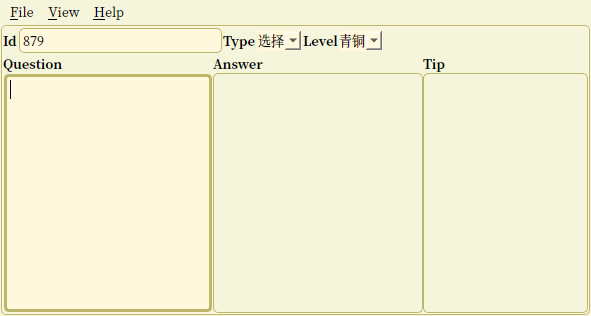
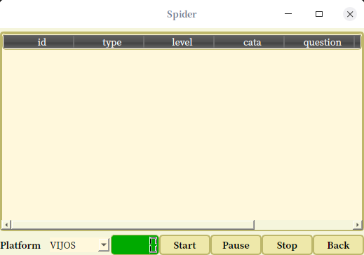
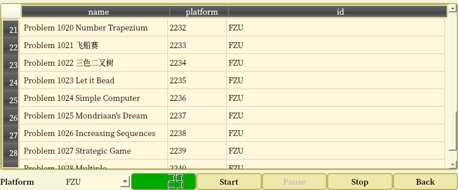
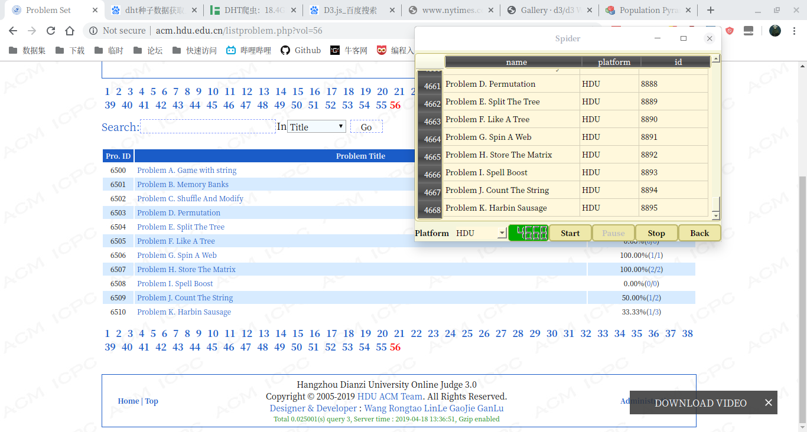
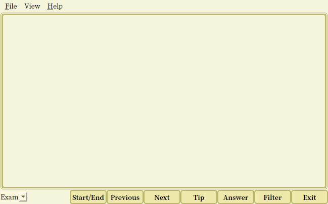
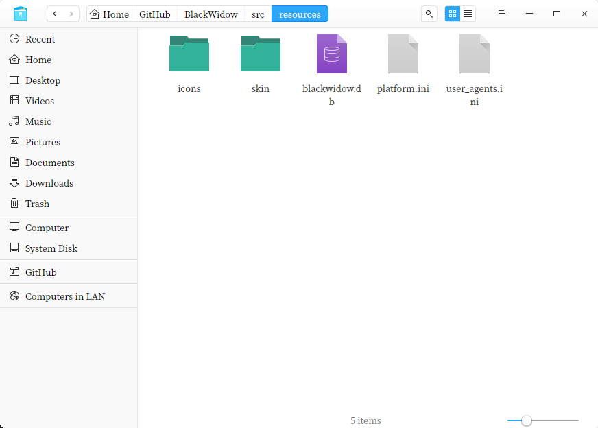
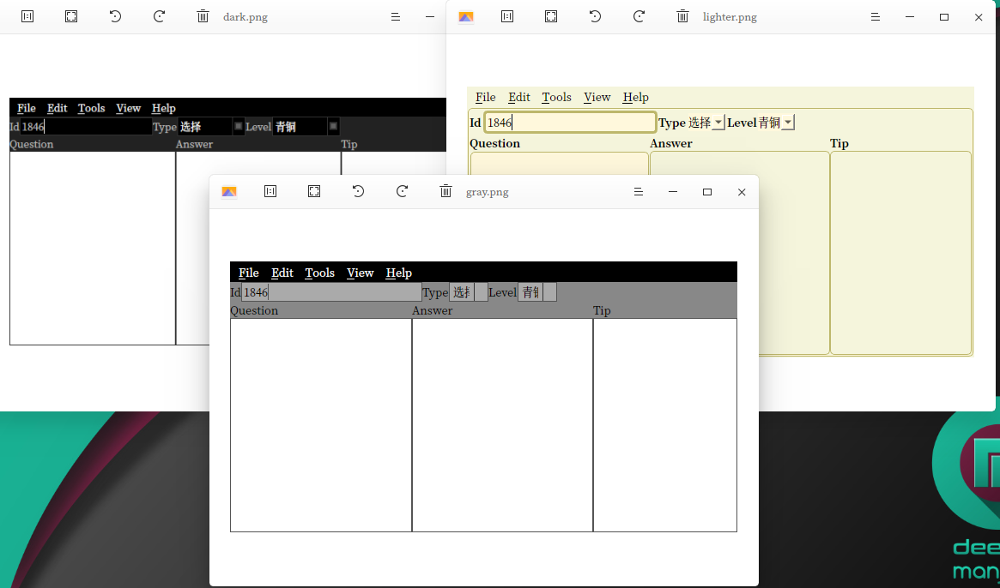

# BlackWidow

## 开发流程

1. 读取配置文件（数据库位置、皮肤名称）
2. 读取数据文件（网站名称列表）
3. 显示界面
4. 开启题库
5. 从第1题开始显示题目数据（题目ID、题目名称、提交人数、通过人数、题目）
6. 点击“显示提示”
7. 在提示文本框显示提示
8. 点击“显示答案”
9. 在答案文本框显示答案
10. 点击“下一题”
11. 如果大于maxID就显示显示第1题，否则显示下一题
12. 点击“上一题”
13. 如果小于1就显示最大ID的题目，否则显示上一题
14. 点击“爬虫”
15. 显示爬虫界面
16. 点击“网站名”下拉文本框，选择一个网站名
17. 清空爬虫界面数据
18. 点击“start”按扭
19. 加载json文件中其他数据（网址、开始ID、题目数据正则表达式、提交人数正则等、结束标志等）
20. 开始爬虫
21. 是否正常，是否结束等等，如果结束则跳转到35，否则继续
22. 拼接网址和ID，生成完整的当前网址
23. 获取网址的网页数据
24. 判断网页数据是否正常，如果包含结束保证则清空，如果是200之外的返回码则清空
25. 获取网页数据中的编码值，并重新编码网页文本
26. 如果网页数据为空则
27. 根据19中的数据进行文本解析
28. 获取题目数据中最长的一句话，并计算MD5值
29. 查询数据库，此MD5值是否存在，如果存在则跳转到32，否则继续
30. 将此MD5值插入MD5表
31. 将其他的数据插入data表
32. 在爬虫界面更新题目名、位置名、ID，同时更新已获取的数量值
33. ID+1，正常数量+1，等等
34. 跳转到21
35. 提示结束
36. 跳转到15

## 说明

OJ爬虫

离线题目管理

题库

使用最长子串的md5值进行相似度判断

## Function

### 1、题目插入

### 2、网络爬虫

获取在线平台 Online Judge上的题目，例如vijos，POJ

获取题目数据中

题目获取结束

### 3、数据处理

查询

答案、提示

### 4、离线题库

### 5、生成试卷

### 6、其他

皮肤--->提供亮色、黑色、灰色

## Version

2020.1.26：

重置项目；

2019.7.20:

移除webview部件；

合并insert 和 query

2019.5.4:

由BlackWidow拆分为两个：insert和query

2019.4.21:

添加所有平台数据，题目数为27117道，题目显示完全

2019.4.20:

添加POJ数据，题目数为20355道

2019.4.19:

添加大视野数据，题目数为16111道。

2019.4.18:

添加LUOGU数据，题目数为13814道;

添加多种字符集支持

2019.4.14:

删除27个子项目，调整软件架构

2019.4.4:

代码结构调整，将平台代码拆分开来

2019.3.2:

采集vijos平台1000-2050编号的数据

2019.2.21:

将项目拆分为两个，一个查询，一个添加题目

2018.8.23：

合并项目ant，改名为Blackwidow；

界面为Ant，黑寡妇作为爬虫模块；

软件结构重构；

2018.8.21:

OJSpider 改名为BlackWidow（黑寡妇）；

删除界面文件，仅保留功能模块；

将所有功能函数整合到两个文件中，作为爬虫模块调用；

添加json库；

2018.8.18

删除UI界面，对软件进行重构，全部采用代码

2018.8.15：

添加图片和图标

2018.8.14：

创建菜单和动作

2018.8.13：

初始化

2018.7.11

删除未使用的功能

2018.6.30

实现列排序，添加GNU GCC编译器;

优化代码显示；

2018.6.22

将正则表达式、网址作为配置文件读取，精简代码

2018.6.21

重构代码结构

2018.6.18

添加代理获取、验证和使用

2018.6.17

添加poj平台

2018.6.16

增加自动判断是否结束；完成vijos平台。

2018.6.14

题目格式、写入、读取

2018.6.3

初始界面、网络连接、文件操作、菜单、菜单栏

## 参考文档
